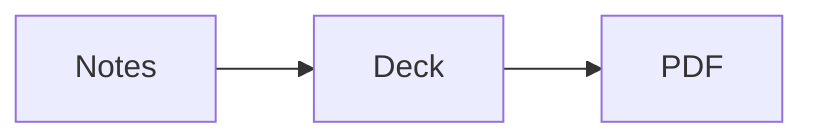

# Content blocks

Beyond plain text, lists, and images, MarkdownDeck recognizes a handful of fenced blocks that turn into rich content: diagrams, charts, data tables, math, and styled callouts. This page covers each block type, the exact fence tag to use, and what happens when a slide holds more than it can fit.

## Diagrams

MarkdownDeck renders two diagram languages from fenced code blocks: **Mermaid** (` ```mermaid `) and **PlantUML** (` ```plantuml `).

````markdown

````

Mermaid is built in and needs no setup. PlantUML runs as a bundled process extension that shells out to the `plantuml` binary — it renders with a 10-second timeout and caches its output. If the binary isn't on your system, the block renders a placeholder instead of a diagram.

> [!NOTE]
> PlantUML requires the `plantuml` binary. Install it with `brew install plantuml`.

## Charts

Chart blocks use the **Vega-Lite** fence tag, ` ```vega-lite ` (the alias ` ```vegalite ` also works). The body is a Vega-Lite JSON spec.

````markdown
```vega-lite
{
  "mark": "bar",
  "data": { "values": [
    { "q": "Q1", "rev": 120 },
    { "q": "Q2", "rev": 180 },
    { "q": "Q3", "rev": 150 }
  ] },
  "encoding": {
    "x": { "field": "q", "type": "nominal" },
    "y": { "field": "rev", "type": "quantitative" }
  }
}
```
````

## Tables

You can write tables two ways. Standard GitHub-Flavored Markdown pipe tables work as-is. For larger or pasted data, use a fenced ` ```csv ` or ` ```tsv ` block: the first row is the header, and the parser is RFC-4180-flavored, so double-quoted fields may contain commas (or tabs), embedded newlines, and `""` for a literal quote.

````markdown
```csv
Quarter,Revenue,Growth
Q1,120,"+8%"
Q2,180,"+50%"
Q3,150,"-17%"
```
````

## Math

Math is typeset with KaTeX. There are three ways to write it.

- **Dollar syntax** — inline `$E=mc^2$`, and display math with `$$` alone on its own lines above and below:

  ````markdown
  $$
  \int_0^1 x^2 \, dx = \tfrac{1}{3}
  $$
  ````

- **Pandoc syntax** — inline `\( … \)` and display `\[ … \]`.

- **Fenced block** — ` ```math ` (the alias ` ```latex ` also works):

  ````markdown
  ```math
  \sum_{i=1}^{n} i = \frac{n(n+1)}{2}
  ```
  ````

> [!TIP]
> Currency is safe. An opening `$` followed by a space, tab, newline, or another `$` — or a closing `$` preceded by a space or tab, or followed by a digit — is **not** treated as math. So `It costs $5 and $10.` renders as ordinary text. If you need a literal dollar sign next to other math, write `\$`.

## Admonitions

Use GitHub-style admonition blockquotes for callouts. Five types are recognized (the keyword is case-insensitive), and admonitions are non-nested.

```markdown
> [!NOTE]
> Useful background information.

> [!TIP]
> A helpful suggestion.

> [!IMPORTANT]
> Something the audience must not miss.

> [!WARNING]
> A potential pitfall.

> [!CAUTION]
> A risky action with consequences.
```

The color and styling of each type comes from the active theme — see [Themes](./05-themes.md) for the selectors you can override.

## When content overflows

If a slide holds more than fits, MarkdownDeck auto-scales the content down to fit the slide rather than clipping it. On screen, an `⚠ overflow` badge appears in the top-right corner of any slide that was shrunk, so you can spot slides worth splitting.

In an exported PDF the badge is hidden by default. To keep it visible in the PDF — handy for proofing — set `overflow_badges: true` in the deck front-matter (see [PDF & image export](./06-pdf-export.md)).

## Where to next

- [Themes](./05-themes.md) — the selectors that color admonitions, tables, charts, and code.
- [PDF & image export](./06-pdf-export.md) — the `overflow_badges` key and what else lands in the PDF.
